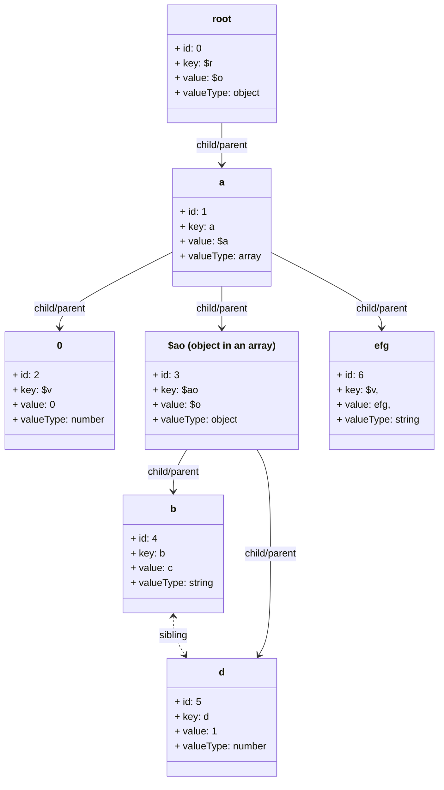

JSXPath
=======

JSXPath is an adaptation of XPath, a querying language for XML documents, to query JSON object.

If you are already familiar with the construct of XPath, using this should be a breeze.

# version

> Latest version: v1.1.3 <br/>

<br/>

# Why JSXPath?
1. Powerful, yet simple to use to perform complex query on JSON data with just a string expression. 
2. Packed full of features out of the box.


```js
  const json = { "a": 1, "b": 2, "c": "pass"}

  /*----------
  without JSXPath
  ----------*/
  function sum(pa, pb) {
    if (!isNumber(pa) || isNumber(pb)) {
      throw new Error("an argument is not a number");
    }
    return pa + pb;
  }

  function isNumber(num) {
    return !isNaN(num) && isFinite(num);
  }

  const result = sum(js.a, js.b) === 3 ? js.c : null;
  // result => 'pass'


  /*----------
  with JSXPath
  ----------*/
  import { runPath } from 'jsxpath';

  const result = runPath('/c[sum(/a | /b) = 3]', { json });
  // result => ['pass']
```

# INSTALL
```cmd
npm install jsxpath
```
# USE
```ts
  const json = {
    a: {
        links: [
          { id: 3, type: 'b' },
          { id: 1, type: 'c' }
        ],
        value: 'master'
    },
    b: [
      { id: 1, value: 'one' },
      { id: 2, value: 'two' },
      { id: 3, value: 'three' }
    ]
  };
```

```ts
  import { runPath } from 'jsxpath';

  // Get the value of "b" that is linked back to "a" by "id"
  const path = '/b/*[id = /a/links/*[type="b"]/id]/value';

  const result = runPath(path, {json}); // ["three"]


  // callback version
  //-------------------------
  runPath({
    path: path,
    then: ({ path, error, value }) => {
      // value => ['three'];

      // run your custom code
    } 
  }, {json});


  // path looks complicated? 
  // use variables.
  //-------------------------
  const result = runPath( '/b/*[id = $aLinkToB_id]/value', 
    { 
      json, variables: { aLinkToB_id: '$root/a/links/*[type="b"]/id' } 
    }
  ); // ["three"]

```

Evaluating multiple paths within one run

```ts

  const json = {
    c: [
      { id: 1, type: 'TypeA', value: 'car'},
      { id: 2, type: 'TypeB', value: 'house'},
      { id: 3, type: 'TypeA', value: 'boat'}
    ]
  }
```

```ts
  import { runPaths } from 'jsxpath';

  const pathsResult = {
    entities: null,
    typeAs: null
  };

  const pathsAndCallbacks: tPathWithCallBack[] = [
    { 
      path: '/c/*/value',
      then: (result) => {
        // custom code
        if (result.value.length) {
          pathsResult.entities = result.value;
        }
      }
    },
    {
      path: '/c/*[type="TypeA"]',
      description: 'type "A" objects in "c"',
      then: ({value, error}) => {
        // custom code
        if (!error) {
          pathsResult.typeAs = value;
        }
      }
    }
  ];

  runPaths( pathsAndCallbacks, { json });

  /*
  * pathsResult => {
  *   entities: ['car', 'house', 'boat'],
  *   typeAs: [
  *     { id: 1, type: 'TypeA', value: 'car'},
  *     { id: 3, type: 'TypeA', value: 'boat'}
  *   ]
  * }
  */
```


# API
These are the 3 methods to run the path expression
```ts
  runPath( path: string, inputProps: tRunPathsInput )
```

<details>
<summary>args</summary>

1. **path**: path expression
2. **inputProps**: tRunPathsInput
- **json**: the json object to interrogate
- **functions**?: see [custom functions](#custom-functions)
- **variables**?: see [variables](#variables)

```ts
type tRunPathsInput {
  json: object,
  functions?: {
    [functionName: string]: (...args: tStack[]) => tStack
  },
  variables?: {
    [variableName: string]: any
  }
};
```
</details>
<br/>

```ts
  runPath( pathProp: tPathWithCallBack, inputProps: tRunPathsInput )
```
<details>
<summary>args</summary>

  1. **pathProp**: tPathWithCallBack
  - **path**: path expression
  - **description**?: describe what this path expression is about
  - **then**: a callback function that accepts the result of executing the path expression.
  ```ts
  type tPathWithCallBack = {
    path: string,
    description?: string,
    active?: boolean,
    then(result: tRunPathResult),
    [key: string]: any
  };

  type tRunPathResult = {
    path: string,
    value: any,
    error?: string
  };
  ```

  2. **inputProps**: tRunPathsInput
  - **json**: the json object to interrogate
  - **functions**?: see [custom functions](#custom-functions)
  - **variables**?: see [variables](#variables)
  - **outputOptions**?: flags to determine extra optionally return values


  ```ts
  type tRunPathsInput {
    json: object,
    functions?: {
      [functionName: string]: (...args: tStack[]) => tStack
    },
    variables?: {
      [variableName: string]: any
    },
    outputOptions?: {
      nodes?: boolean
    }
  };
  ```

</details>
<br/>

```ts
  runPaths( pathProp: tPathWithCallBack[], inputProps: tRunPathsInput )
```

<details>
<summary>args</summary>

  1. **pathProp**: tPathWithCallBack[]
  - **path**: path expression
  - **description**?: describe what this path expression is about
  - **then**: a callback function that accepts the result of executing the path expression.
  ```ts
  type tPathWithCallBack = {
    path: string,
    description?: string,
    active?: boolean,
    then(result: tRunPathResult),
    [key: string]: any
  };

  type tRunPathResult = {
    path: string,
    value: any,
    error?: string
  };
  ```

  2. **inputProps**: tRunPathsInput
  - **json**: the json object to interrogate
  - **functions**?: see [custom functions](#custom-functions)
  - **variables**?: see [variables](#variables)
  - **outputOptions**?: flags to determine extra optionally return values

  ```ts
  type tRunPathsInput {
    json: object,
    functions?: {
      [functionName: string]: (...args: tStack[]) => tStack
    },
    variables?: {
      [variableName: string]: any
    },
    outputOptions?: {
      nodes?: boolean
    }
  };
  ```

</details>
<br/>


# Differences & Limitations
There are some notable differences and limiations between xml and json that the query langauge do not support.
- The '@' symbol is not used in JSXPath expression since JSON only consists of key value pair. '@' in XML denotes an attribute.
- The axis 'preceding', 'preceding-sibling', 'following', and 'following-sibling' is not supported. JSON is a hash map, the keys are not always returned in a particular order. Instead JSXPath supports 'sibling' that looks for key value within the same object.
- The operator token keywords are reserved. This means that the keys in the json cannot contain the following symbols (|,/,+, -, %, *, =, >, <) and spaces


# FEATURES

## Operators
| Operators | |
|---|---|
| &#124; | Unary |
| + | Addition |
| - | Subtraction |
| * | Multiplication |
| div | Division |
| = | Equal |
| != | Not Equal |
| < | Less Than |
| <= | Less Than or Equal to |
| > | Greater Than |
| >= | Greater Than or Equal to |
| or | Or |
| and | And |
| mod | Modulus |

## Axes
| Select | |
|---|---|
| . | Current |
| .. | Parent from Current |
| / | Root or Child from Current |
| // | Descendants from Current |
| * | Any child nodes from Current | 
| parent | Parent from Current |
| ancestor::(node-name) | Ancestors from Current |
| ancestor-or-self::(node-name) | Ancestors + Current from Current |
| child::(node-name) | Child from Current |
| descendant::(node-name) | Descendants from Current |
| descendant-or-self::(node-name) | Descendants + Current from Current |
| sibling::(node-name) | Sibling of Current (key name within the same object)|

## Functions
### Built in functions

| Name | <div style="width:320px">Example</div> | <div style="width:150px">Result</div> | Comment |
|--|--|--|--|
| abs | path = "abs(-1)" | 1 |
| boolean | path = 'boolean("string")' | true | if arg is node list, returns true if list is not empty |
| ceiling | path = 'ceiling(1.2)' | 2 | |
| choose | path = 'choose(1=1, "abc", "def")' | "abc" | if first arg evaluates to true, return 2nd arg otherwise return 3rd arg |
| concat | path= 'concat("ab", " ", "cd", ": ", 1, " is ", true)'  | "ab cd: 1 is true" | Converts number or boolean type to a string, if it is a node type will interrogate and return the value of the first node item
| contains | path = 'contains("needle haystack", "hay")' | true | |
| count | path = 'count(//a)' | count the number of nodes with key value of "a" starting from root node | |
| false | path = 'false = false()' | true |
| first | path = '/a/*[first()]' | first() returns the first position of the node list | index is 1 base |
| floor | path = 'floor(1.2)' | 1 |
| last | path = '/a/*[last()]' | last() returns the last position of the node list | index is 1 base |
| local-name | path = '//*[local-name() = "abc"]' | The key name of the node | see example
| name | path = '//*[name() = "abc"]' | equivalent to local-name |
| not | path = '/a/*[not(b > 1)]' | return all child nodes of a whose b value is less than or equal to 1 | 
| number | path = 'number(/a)' | return the number value of the first node of a | if it's a string or boolean type, it will try to convert it to a number value, otherwise return NAN. Throws an error if the passed in type is not a string, number, or boolean.
| round | path = 'round(4.4)', 'round(4.5)' | 4 , 5 | round the number to the nearest integer value
| string | path = 'string(1.1)' | '1.1' | convert and return a string value. Throws an error if the passed in type is not a string, number, or boolean. |
| substring-after | path = 'string-after("haystack", "st") | "ack" | | 
| substring-before | path = 'string-before("haystack", "st") | "hay" | | 
| sum | path = 'sum(/a/*/b)' | sum all value of b | Throws an error if the value is not node and is of number type |
| true | path = 'true = true()' | true | |

### Examples
```ts
  import {runPaths} from 'jsxpath';

  const budget = {
    incomes: [
      { id: 1, type: 'salary', display: 'salary', value: 2000.30, frequency: 'monthly'},
      { id: 2, type: 'rent', display: 'rent', value: 300.95, frequency: 'fortnightly'},
      { id: 3, type: 'share', display: 'shares', value: 0.20, frequency: 'monthly'}
    ],
    expenses: [
      { id: 1, type: 'transport', display: 'car', value: -200.70, frequency: 'fortnightly' },
      { id: 2, type: 'household', display: 'grocery', value: -400.20, frequency: 'monthly' },
      { id: 3, type: 'transport', display: 'train', value: -200.10, frequency: 'monthly' },
      { id: 4, type: 'household', display: 'gardening', value: -20.10, frequency: 'monthly' }
    ]
  }
```
```ts
  /* 
  * evaluate a series of paths to extract required expenses
  * and incomes to calculate the net income per month
  */
  let totalIncomePerMonth = 0;
  runPaths([
    {
      path: 'sum(/incomes/*[frequency="monthly"][floor(value) >= 1]/value)',
      then: ({value}) => {
        // returns salary value
        totalIncomePerMonth += value;
      }
    },
    {
      path: 'sum(/incomes/*[frequency="fortnightly"]/value) * 2',
      then: ({value}) => {
        // returns rent value
        totalIncomePerMonth += value;
      }
    },
    {
      path: 'sum(/expenses/*[frequency="monthly"][abs(value) > 25]/value)',
      then: ({value}) => {
        // returns grocery and train sum value
        totalIncomePerMonth += value;
      }
    },
    {
      path: 'sum(/expenses/*[frequency="fortnightly"]/value) * 2',
      then: ({value}) => {
        // returns car value
        totalIncomePerMonth += value;
      }
    }
  ], {json: budget});

  // totalIncomePerMonth = 1600.5
```
Other function examples
``` ts
  runPaths([
    {
      path: '/incomes/*[first()]/display',
      description: 'first() eg',
      then: ({value}) => {
        // value => ['salary']
      }
    },
    {
      path: '/incomes/*[last()]',
      description: 'last() eg',
      then: ({value}) => {
        // value => [{ id: 3, type: 'share', display: 'shares', value: 0.20, frequency: 'monthly'}]
      }
    },
    {
      path: 'count(/incomes/*[frequency = "monthly"])',
      description: 'count() eg',
      then: ({value}) => {
        // value => 2;
      }
    },
    {
      path: '//*[local-name()="id"][sibling::type = "transport"]',
      description: 'local-name() eg',
      then: ({value}) => {
        // value => [1, 3];
      }
    },
    {
      path: '/expenses/*[concat(type, ":", display) = "transport:train"]/value',
      description: 'concat() eg',
      then: ({value}) => {
        // value => [-200.10]
      }
    }
  ], { json: budget });

```
### Custom functions

JSXPath supports the ability for you to write your own custom functions and be able to refer to it in the path expression. It is passed into the runPath or runPaths as part of the second argument and has the signature of:

```ts
  type tRunPathsInput {
    json: object,
    functions?: {
      [functionName: string]: (...args: tStack[]) => tStack
    },
    ...
  };
```
Functions accepts a list of tStack arguments and expected to return a tStack value
```ts
  // for the purpose of functions, we would expect 
  // tStack to typically have the following definition
  type tStack {
    type: 'nodes' | 'boolean' | 'string' | 'number', 
    value: tNode[] | boolean | string | number
  };
```

Example: custom function to get maximum value in a list of nodes

```ts
  import { runPath, KEYS } from './index';

  const json = {
    a: [
      {value: 3},
      {value: '90'},
      {value: 16}
    ],
    b: [
      {value: -1},
      {value: 30},
      {value: true}
    ]
  };

  // defining custom functions
  functions = {
    max: (item: tStack): tStack => {
      if (item.type !== 'nodes') {
        throw new Error('[functions.max], invalid arg type. Was expecting nodes');
      }
      // loop through the node list, check if the type is a number
      // and has a value greater than the current max value
      const value = item.value.reduce((maxNumber, node) => {
        if (node[KEYS.valueType] === 'number' && node[KEYS.value] > maxNumber) {
          maxNumber = node[KEYS.value];
        }
        return maxNumber;
      }, 0);
      
      return { type: 'number', value };
    },
    //... more functions
  };

  const maxPlus10 = runPath('max( /a/*/value | /b/*/value ) + 10', { json, functions });
  // maxPlus10 => 40
```
> *Refer to [about JSXPath nodes](#about-jsxpath-nodes) to see how JSXPath converts JSON object into nodes.*

## Variables
A **powerful!!** feature to link to another value that can be used as part of path expressions. 
- Variables in path expression starts with $ sign followed by the name of the key passed in the variable object. 
- Variable does not have to be actual values, it can also be a path expression in itself.

Consider the budget example set up in the [functions](#functions) section above. We can simplify it using variable paths expressions.
```ts
  import {runPath} from 'jsxpath';

  const budget = {
    incomes: [
      { id: 1, type: 'salary', display: 'salary', value: 2000.30, frequency: 'monthly'},
      { id: 2, type: 'rent', display: 'rent', value: 300.95, frequency: 'fortnightly'},
      { id: 3, type: 'share', display: 'shares', value: 0.20, frequency: 'monthly'}
    ],
    expenses: [
      { id: 1, type: 'transport', display: 'car', value: -200.70, frequency: 'fortnightly' },
      { id: 2, type: 'household', display: 'grocery', value: -400.20, frequency: 'monthly' },
      { id: 3, type: 'transport', display: 'train', value: -200.10, frequency: 'monthly' },
      { id: 4, type: 'household', display: 'gardening', value: -20.10, frequency: 'monthly' }
    ]
  }
```

```ts
  const totalIncomePerMonth = runPath(
    '$incomeMonthlyTypes + $incomeFortnightlyTypes + $expenseMonthlyTypes + $expenseFortnightlyTypes', 
    {
      json: budget,
      variables: {
        incomeMonthlyTypes: 'sum($root/incomes/*[frequency="monthly"][floor(value) >= 1]/value)',
        incomeFortnightlyTypes: 'sum($root/incomes/*[frequency="fortnightly"]/value) * 2',
        expenseMonthlyTypes: 'sum($root/expenses/*[frequency="monthly"][abs(value) > 25]/value)',
        expenseFortnightlyTypes: 'sum($root/expenses/*[frequency="fortnightly"]/value) * 2'
      }
    }
  );
  
  // totalIncomePerMonth = 1600.5
```

> Note that on initialization, the passed in json is stored as a variable with the name $root. $root can be referenced in both the main path or variable path expression

<br/>

Example below shows additional ways of using variables
- tuitionType is a literal object value
- tuitionAmount is a path expression referencing $tuitionType
- $tuitionAmount is referenced in the main path expression

```ts
  runPath({
    path: 'abs($tuitionAmount) > abs(/expenses/*[display="gardening"]/value)',
    description: 'Is tuition fee cost more than the amount spent on gardening?',
    then: ({value}) => {
      // custom code here
      const message = value === true ?
        'Tuition is overly expensive. We should spend our time on gardening':
        'Tuition is still dirt cheap.'
      console.log(message);
    }
  }, {
    json: budget,
    variables: {
      tuitionType: { id: 100, type: 'education', display: 'tuition', value: -80, frequency: 'monthly' },
      tuitionAmount: '$tuitionType/value'
    }
  });

  // console.log => 'Tuition is overly expensive. We should spend our time on gardening'
```


# About JSXPath nodes

In JSXPath, we natively deconstruct the passed in JSON object into a series of nodes in order to make it easier to traverse and perform a deep comparisons without relying on third party libraries. Before returning the result, JSXPath will reconstruct the filtered down node(s) as an array of JSON object.

Node have the following shape

```ts
  type tNode = [
    id: number,
    depth: number,
    group: number|string,
    arrayPosition: number|string,
    key: string,
    value: any,
    valueType: string,
    links: {
      parentId?: number,
      childrenIds?: number[],
      descendantIds?: number[],
      ancestorIds?: number[],
      siblings?: number[]
    }
  ];
```
Given the passed in JSON is

```ts
  {
    a: [
      0,
      {b: 'c', d: 1},
      'efg'
    ]
  }
```
it is deconstructed into a list of array nodes and linked together as shown below diagramatically.


> apart from child/parent/sibling relationship, each node have links to ancestors and descendants


Helper functions are provided that can be used in custom functions
```ts
  import { KEYS, nodesOps } from 'jsxpath';

  // Actual node properties can be accessed via the KEYS object
  nodeA[KEYS.valueType] //object, array, string,...
  nodeA[KEYS.value]
  nodeA[KEYS.links].childrenIds // [1, 4, ...]

  // Get the linked nodes
  nodesOps.get.ancestors(currentNode: tNode, nodeName?: string): tNode[];
  nodesOps.get.children(currentNode: tNode, nodeName?: string): tNode[];
  nodesOps.get.descendants(currentNode: tNode, nodeName?: string): tNode[];
  nodesOps.get.parent(currentNode: tNode, nodeName?: string): tNode;
  nodesOps.get.siblings(currentNode: tNode, nodeName?: string): tNode[];

  // convert the node into its' JSON value
  nodesOps.reconstruct(nodes: tNode[]): (iJSONArray|tJSONObject)[];

  // test to see if two nodes are equal (deep)
  nodesOps.test.isEqual(node1: tNode, node2: tNode): boolean;

```


# ROADMAP
- better error handling overall
- achieve 100% code coverage if possible
- introduce date functions


