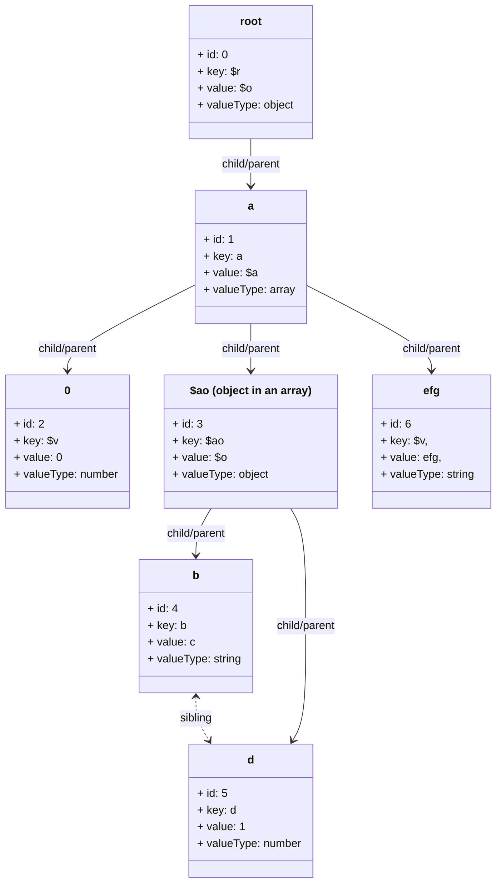

# JSXPath

[](https://www.npmjs.com/package/jsxpath)
[](LICENSE)

An XPath-inspired query language for JSON objects.

If you're already familiar with XPath, using JSXPath will be intuitive and straightforward.

## Table of Contents

- [Why JSXPath?](#why-jsxpath)
- [Installation](#installation)
- [Quick Start](#quick-start)
- [API Reference](#api-reference)
- [Features](#features)
  - [Operators](#operators)
  - [Axes](#axes)
  - [Functions](#functions)
  - [Variables](#variables)
  - [Complex Predicates](#complex-predicates)
- [Error Handling](#error-handling)
- [TypeScript Support](#typescript-support)
- [Differences from XPath](#differences-from-xpath)
- [Advanced Topics](#advanced-topics)
- [Roadmap](#roadmap)

## Why JSXPath?

- **Powerful & Simple**: Query complex JSON with string expressions
- **Feature-Rich**: Built-in functions, variables, custom functions, and more
- **Familiar Syntax**: XPath users will feel right at home

```ts
  const json = { 'a': 1, 'b': 2, 'c': 'pass' };

  /*----------
  without JSXPath
  ----------*/
  function sum(pa, pb) {
    if (!isNumber(pa) || !isNumber(pb)) {
      throw new Error('an argument is not a number');
    }
    return pa + pb;
  }

  function isNumber(num) {
    return !isNaN(num) && isFinite(num);
  }

  const result = sum(json.a, json.b) === 3 ? json.c : null;
  // result => 'pass'


  /*----------
  with JSXPath
  ----------*/
  import { runPath } from 'jsxpath';

  const result = runPath('/c[sum(/a | /b) = 3]', { json });
  // result => ['pass']
```

## Installation

```bash
npm install jsxpath
```

## Quick Start

### Simple Query

```ts
import { runPath } from 'jsxpath';

const json = { user: { name: 'John', age: 30 } };

const result = runPath('/user/name', { json });
// result => ['John']
```

> **Note**: Results are always returned as arrays.

### Filtering with Predicates

```ts
const json = { 
  users: [
    { name: 'John', age: 30 }, 
    { name: 'Jane', age: 25 }
  ] 
};

const result = runPath('/users/*[age > 26]/name', { json });
// result => ['John']
```

### Complex Queries

Get values from one part of JSON based on conditions in another:

```ts
const json = {
  a: {
    links: [
      { id: 3, type: 'b' },
      { id: 1, type: 'c' }
    ],
    value: 'master'
  },
  b: [
    { id: 1, value: 'one' },
    { id: 2, value: 'two' },
    { id: 3, value: 'three' }
  ]
};
```

```ts
import { runPath } from 'jsxpath';

// Get the value of 'b' that is linked back to 'a' by 'id'
const path = '/b/*[id = /a/links/*[type="b"]/id]/value';

const result = runPath(path, { json }); 
// result => ['three']
```

### Using Callbacks

```ts
import { runPath } from 'jsxpath';

runPath({
  path: '/b/*[id = /a/links/*[type="b"]/id]/value',
  then: ({ path, error, value }) => {
    // value => ['three']
    // Run your custom code here
  } 
}, { json });
```

### Simplifying with Variables

Path expressions can get complex. Use variables to make them more readable:

```ts
const result = runPath('/b/*[id = $aLinkToB_id]/value', 
  { 
    json, 
    variables: { 
      aLinkToB_id: '$root/a/links/*[type="b"]/id' 
    } 
  }
);
// result => ['three']
```

> **Tip**: The JSON input is automatically available as `$root` in all path and variable expressions.

### Multiple Paths

Execute multiple queries in a single call:

```ts
import { runPaths } from 'jsxpath';

const json = {
  c: [
    { id: 1, type: 'TypeA', value: 'car' },
    { id: 2, type: 'TypeB', value: 'house' },
    { id: 3, type: 'TypeA', value: 'boat' }
  ]
};

const pathsResult = {
  entities: null,
  typeAs: null
};

const pathsAndCallbacks = [
  { 
    path: '/c/*/value',
    then: (result) => {
      if (result.value.length) {
        pathsResult.entities = result.value;
      }
    }
  },
  {
    path: '/c/*[type="TypeA"]',
    description: 'type "A" objects in "c"',
    then: ({ value, error }) => {
      if (!error) {
        pathsResult.typeAs = value;
      }
    }
  }
];

runPaths(pathsAndCallbacks, { json });

/*
 * pathsResult => {
 *   entities: ['car', 'house', 'boat'],
 *   typeAs: [
 *     { id: 1, type: 'TypeA', value: 'car' },
 *     { id: 3, type: 'TypeA', value: 'boat' }
 *   ]
 * }
 */


## API Reference

JSXPath provides three main methods for executing path expressions.

### Types

```ts
type tRunPathsInput = {
  json: object;
  functions?: {
    [functionName: string]: (...args: tStack[]) => tStack
  };
  variables?: {
    [variableName: string]: any
  };
  outputOptions?: {
    nodes?: boolean
  };
};

type tPathWithCallBack = {
  path: string;
  description?: string;
  active?: boolean;
  then: (result: tRunPathResult) => void;
  [key: string]: any;
};

type tRunPathResult = {
  path: string;
  value: any;
  error?: string;
};
```

### Methods

#### `runPath(path: string, input: tRunPathsInput): any[]`

Executes a single path expression and returns the result as an array.

**Parameters:**
- `path`: The path expression string
- `input`: Configuration object containing:
  - `json`: The JSON object to query
  - `functions?`: Custom functions (see [Custom Functions](#custom-functions))
  - `variables?`: Variables for use in expressions (see [Variables](#variables))

**Returns:** Array of matched values

**Example:**
```ts
const result = runPath('/users/*[age > 25]/name', { json });
```

---

#### `runPath(pathProp: tPathWithCallBack, input: tRunPathsInput): void`

Executes a path expression with a callback function.

**Parameters:**
- `pathProp`: Object containing:
  - `path`: The path expression string
  - `description?`: Optional description of what the path does
  - `then`: Callback function that receives `{ path, value, error }`
  - `active?`: Set to `false` to skip execution (default: `true`)
- `input`: Same as above, with optional `outputOptions.nodes` for internal node details

**Example:**
```ts
runPath({
  path: '/users/*[age > 25]',
  description: 'Users older than 25',
  then: ({ value, error }) => {
    if (!error) console.log(value);
  }
}, { json });
```

---

#### `runPaths(paths: tPathWithCallBack[], input: tRunPathsInput): void`

Executes multiple path expressions with callbacks in a single call.

**Parameters:**
- `paths`: Array of path configuration objects (same structure as `tPathWithCallBack`)
- `input`: Same as above

**Example:**
```ts
runPaths([
  {
    path: '/users/*/name',
    then: (result) => { /* handle names */ }
  },
  {
    path: '/users/*[age > 25]',
    then: (result) => { /* handle filtered users */ }
  }
], { json });
```

## Differences from XPath

JSXPath adapts XPath for JSON with the following key differences:

| XPath Feature | JSXPath Equivalent | Reason |
|--------------|-------------------|--------|
| `@attribute` | Not supported | JSON uses key-value pairs, no attributes |
| `preceding::`, `following::` | Not supported | JSON keys have no guaranteed order |
| `preceding-sibling::`, `following-sibling::` | `sibling::` | Finds keys within the same object |

### Reserved Tokens

Keys cannot contain these symbols: `|`, `/`, `+`, `-`, `%`, `*`, `=`, `>`, `<`, or spaces

### Operator Precedence

Operators follow standard precedence rules. Notably, `and` has higher precedence than `or`:

```ts
// The expression: [A and B or C] 
// Is evaluated as: [(A and B) or C]
const json = { items: [{ a: 1, b: 2, c: 5 }] };
runPath('/items/*[a=1 and b=2 or c>10]', { json });
// Matches items where (a=1 AND b=2) OR (c>10)
```

## Features

## Operators
| Operators | |
|---|---|
| &#124; | Unary |
| + | Addition |
| - | Subtraction |
| * | Multiplication |
| div | Division |
| = | Equal |
| != | Not Equal |
| < | Less Than |
| <= | Less Than or Equal to |
| > | Greater Than |
| >= | Greater Than or Equal to |
| or | Or |
| and | And |
| mod | Modulus |

## Axes

| Axis | Example | Description |
|------|---------|-------------|
| `.` | `./name` | Current node |
| `..` | `../name` | Parent node |
| `/` | `/root` | Root or child |
| `//` | `//name` | Descendants |
| `*` | `/users/*` | All children |
| `self::` | `self::node()` | Current node |
| `parent::` | `parent::user` | Parent node |
| `child::` | `child::name` | Direct children |
| `ancestor::` | `ancestor::root` | All ancestors |
| `ancestor-or-self::` | `ancestor-or-self::user` | Ancestors + self |
| `descendant::` | `descendant::id` | All descendants |
| `descendant-or-self::` | `descendant-or-self::user` | Descendants + self |
| `sibling::` | `sibling::name` | Keys in same object |

## Complex Predicates

JSXPath supports complex filtering with nested predicates and multiple conditions.

### Operator Precedence in Predicates

Operators are evaluated with standard precedence. The `and` operator has higher precedence than `or`:

```ts
const json = {
  items: [
    { id: 1, b: { c: 1 }, d: 'test', e: 10 },
    { id: 2, b: { c: 2 }, d: 'test', e: 3 },
    { id: 3, b: { c: 1 }, d: 'other', e: 8 }
  ]
};

// Expression: [b/c=1 and d="test" or e > 5]
// Evaluated as: [(b/c=1 AND d="test") OR (e > 5)]
const result = runPath('/items/*[b/c=1 and d="test" or e > 5]', { json });
// Returns items 1 and 3
```

### Nested Predicates

Filter by nested conditions within arrays or objects:

```ts
const json = {
  data: [
    { id: 1, tags: [{ name: 'urgent', value: 1 }] },
    { id: 2, tags: [{ name: 'normal', value: 2 }] }
  ]
};

// Find items with nested tag matching criteria
const result = runPath('/data/*[tags/*[name="urgent"]]', { json });
// Returns item 1
```

### Complex Sibling Lookups

Use the `sibling::` axis to check properties of sibling keys within the same object:

```ts
const json = {
  records: [
    { id: 1, type: 'user', status: 'active' },
    { id: 2, type: 'admin', status: 'active' },
    { id: 3, type: 'user', status: 'inactive' }
  ]
};

// Find all 'id' nodes where the sibling 'type' equals 'user'
const result = runPath('//*[local-name()="id"][sibling::type="user"]', { json });
// Returns [1, 3]
```

## Functions
### Built in functions

| Name | <div style="width:320px">Example</div> | <div style="width:150px">Result</div> | Comment |
|--|--|--|--|
| abs | path = "abs(-1)" | 1 |
| boolean | path = 'boolean("string")' | true | if arg is node list, returns true if list is not empty |
| ceiling | path = 'ceiling(1.2)' | 2 | |
| choose | path = 'choose(1=1, "abc", "def")' | "abc" | if first arg evaluates to true, return 2nd arg otherwise return 3rd arg |
| concat | path= 'concat("ab", " ", "cd", ": ", 1, " is ", true)'  | "ab cd: 1 is true" | Converts number or boolean type to a string, if it is a node type will interrogate and return the value of the first node item
| contains | path = 'contains("needle haystack", "hay")' | true | |
| count | path = 'count(//a)' | count the number of nodes with key value of "a" starting from root node | |
| false | path = 'false = false()' | true |
| first | path = '/a/*[first()]' | first() returns the first position of the node list | index is 1 base |
| floor | path = 'floor(1.2)' | 1 |
| last | path = '/a/*[last()]' | last() returns the last position of the node list | index is 1 base |
| local-name | path = '//*[local-name() = "abc"]' | The key name of the node | see example
| name | path = '//*[name() = "abc"]' | equivalent to local-name |
| not | path = '/a/*[not(b > 1)]' | return all child nodes of a whose b value is less than or equal to 1 | 
| number | path = 'number(/a)' | return the number value of the first node of a | if it's a string or boolean type, it will try to convert it to a number value, otherwise return NAN. Throws an error if the passed in type is not a string, number, or boolean.
| round | path = 'round(4.4)', 'round(4.5)' | 4 , 5 | round the number to the nearest integer value
| string | path = 'string(1.1)' | '1.1' | convert and return a string value. Throws an error if the passed in type is not a string, number, or boolean. |
| substring-after | path = 'substring-after("haystack", "st")' | "ack" | | 
| substring-before | path = 'substring-before("haystack", "st")' | "hay" | | 
| sum | path = 'sum(/a/*/b)' | sum all value of b | Throws an error if the value is not node and is of number type |
| true | path = 'true = true()' | true | |

### Examples
```ts
  import {runPaths} from 'jsxpath';

  const budget = {
    incomes: [
      { id: 1, type: 'salary', display: 'salary', value: 2000.30, frequency: 'monthly'},
      { id: 2, type: 'rent', display: 'rent', value: 300.95, frequency: 'fortnightly'},
      { id: 3, type: 'share', display: 'shares', value: 0.20, frequency: 'monthly'}
    ],
    expenses: [
      { id: 1, type: 'transport', display: 'car', value: -200.70, frequency: 'fortnightly' },
      { id: 2, type: 'household', display: 'grocery', value: -400.20, frequency: 'monthly' },
      { id: 3, type: 'transport', display: 'train', value: -200.10, frequency: 'monthly' },
      { id: 4, type: 'household', display: 'gardening', value: -20.10, frequency: 'monthly' }
    ]
  }
```
```ts
  /* 
  * evaluate a series of paths to extract required expenses
  * and incomes to calculate the net income per month
  */
  let totalIncomePerMonth = 0;
  runPaths([
    {
      path: 'sum(/incomes/*[frequency="monthly"][floor(value) >= 1]/value)',
      then: ({value}) => {
        // returns salary value
        totalIncomePerMonth += value;
      }
    },
    {
      path: 'sum(/incomes/*[frequency="fortnightly"]/value) * 2',
      then: ({value}) => {
        // returns rent value
        totalIncomePerMonth += value;
      }
    },
    {
      path: 'sum(/expenses/*[frequency="monthly"][abs(value) > 25]/value)',
      then: ({value}) => {
        // returns grocery and train sum value
        totalIncomePerMonth += value;
      }
    },
    {
      path: 'sum(/expenses/*[frequency="fortnightly"]/value) * 2',
      then: ({value}) => {
        // returns car value
        totalIncomePerMonth += value;
      }
    }
  ], {json: budget});

  // totalIncomePerMonth = 1600.5
```
Other function examples
``` ts
  runPaths([
    {
      path: '/incomes/*[first()]/display',
      description: 'first() eg',
      then: ({value}) => {
        // value => ['salary']
      }
    },
    {
      path: '/incomes/*[last()]',
      description: 'last() eg',
      then: ({value}) => {
        // value => [{ id: 3, type: 'share', display: 'shares', value: 0.20, frequency: 'monthly'}]
      }
    },
    {
      path: 'count(/incomes/*[frequency = "monthly"])',
      description: 'count() eg',
      then: ({value}) => {
        // value => 2;
      }
    },
    {
      path: '//*[local-name()="id"][sibling::type = "transport"]',
      description: 'local-name() eg',
      then: ({value}) => {
        // value => [1, 3];
      }
    },
    {
      path: '/expenses/*[concat(type, ":", display) = "transport:train"]/value',
      description: 'concat() eg',
      then: ({value}) => {
        // value => [-200.10]
      }
    }
  ], { json: budget });

```
### Custom functions

JSXPath supports the ability for you to write your own custom functions and be able to refer to it in the path expression. It is passed into the runPath or runPaths as part of the second argument and has the signature of:

```ts
  type tRunPathsInput {
    json: object,
    functions?: {
      [functionName: string]: (...args: tStack[]) => tStack
    },
    ...
  };
```
Functions accepts a list of tStack arguments and expected to return a tStack value
```ts
  // for the purpose of functions, we would expect 
  // tStack to typically have the following definition
  type tStack {
    type: 'nodes' | 'boolean' | 'string' | 'number', 
    value: tNode[] | boolean | string | number
  };
```

Example: custom function to get maximum value in a list of nodes

```ts
  import { runPath, KEYS } from './index';

  const json = {
    a: [
      {value: 3},
      {value: '90'},
      {value: 16}
    ],
    b: [
      {value: -1},
      {value: 30},
      {value: true}
    ]
  };

  // defining custom functions
  functions = {
    max: (item: tStack): tStack => {
      if (item.type !== 'nodes') {
        throw new Error('[functions.max], invalid arg type. Was expecting nodes');
      }
      // loop through the node list, check if the type is a number
      // and has a value greater than the current max value
      const value = item.value.reduce((maxNumber, node) => {
        if (node[KEYS.valueType] === 'number' && node[KEYS.value] > maxNumber) {
          maxNumber = node[KEYS.value];
        }
        return maxNumber;
      }, 0);
      
      return { type: 'number', value };
    },
    //... more functions
  };

  const maxPlus10 = runPath('max( /a/*/value | /b/*/value ) + 10', { json, functions });
  // maxPlus10 => 40
```
> *Refer to [about JSXPath nodes](#about-jsxpath-nodes) to see how JSXPath converts JSON object into nodes.*

## Variables
A **powerful!!** feature to link to another value that can be used as part of path expressions. 
- Variables in path expression starts with $ sign followed by the name of the key passed in the variable object. 
- Variable does not have to be actual values, it can also be a path expression in itself.

Consider the budget example set up in the [functions](#functions) section above. We can simplify it using variable paths expressions.
```ts
  import {runPath} from 'jsxpath';

  const budget = {
    incomes: [
      { id: 1, type: 'salary', display: 'salary', value: 2000.30, frequency: 'monthly'},
      { id: 2, type: 'rent', display: 'rent', value: 300.95, frequency: 'fortnightly'},
      { id: 3, type: 'share', display: 'shares', value: 0.20, frequency: 'monthly'}
    ],
    expenses: [
      { id: 1, type: 'transport', display: 'car', value: -200.70, frequency: 'fortnightly' },
      { id: 2, type: 'household', display: 'grocery', value: -400.20, frequency: 'monthly' },
      { id: 3, type: 'transport', display: 'train', value: -200.10, frequency: 'monthly' },
      { id: 4, type: 'household', display: 'gardening', value: -20.10, frequency: 'monthly' }
    ]
  }
```

```ts
  const totalIncomePerMonth = runPath(
    '$incomeMonthlyTypes + $incomeFortnightlyTypes + $expenseMonthlyTypes + $expenseFortnightlyTypes', 
    {
      json: budget,
      variables: {
        incomeMonthlyTypes: 'sum($root/incomes/*[frequency="monthly"][floor(value) >= 1]/value)',
        incomeFortnightlyTypes: 'sum($root/incomes/*[frequency="fortnightly"]/value) * 2',
        expenseMonthlyTypes: 'sum($root/expenses/*[frequency="monthly"][abs(value) > 25]/value)',
        expenseFortnightlyTypes: 'sum($root/expenses/*[frequency="fortnightly"]/value) * 2'
      }
    }
  );
  
  // totalIncomePerMonth = 1600.5
```

Example below shows additional ways of using variables
- tuitionType is a literal object value
- tuitionAmount is a path expression referencing $tuitionType
- $tuitionAmount is referenced in the main path expression

```ts
  runPath({
    path: 'abs($tuitionAmount) > abs(/expenses/*[display="gardening"]/value)',
    description: 'Is tuition fee cost more than the amount spent on gardening?',
    then: ({value}) => {
      // custom code here
      const message = value === true ?
        'Tuition is overly expensive. We should spend our time on gardening':
        'Tuition is still dirt cheap.'
      console.log(message);
    }
  }, {
    json: budget,
    variables: {
      tuitionType: { id: 100, type: 'education', display: 'tuition', value: -80, frequency: 'monthly' },
      tuitionAmount: '$tuitionType/value'
    }
  });

  // console.log => 'Tuition is overly expensive. We should spend our time on gardening'
```

## Error Handling

When using the callback version of `runPath` or `runPaths`, errors are captured and passed to your callback:

```ts
runPath({
  path: '/items/*[id > 0]',
  then: ({ value, error }) => {
    if (error) {
      console.error('Query failed:', error);
      return;
    }
    // Process value
    console.log('Results:', value);
  }
}, { json });
```

Common error scenarios:
- Invalid path syntax
- Type mismatches in operations (e.g., comparing number with string)
- Undefined variables or functions
- Invalid function arguments

## TypeScript Support

JSXPath is written in TypeScript and includes full type definitions:

```ts
import { runPath, runPaths, KEYS, NodesOps } from 'jsxpath';
import type { 
  tRunPathsInput, 
  tPathWithCallBack, 
  tRunPathResult,
  tStack,
  tNode 
} from 'jsxpath';

// Type-safe path execution
const json = { users: [{ name: 'John', age: 30 }] };

const result: any[] = runPath('/users/*/name', { json });

// Type-safe callback
const pathConfig: tPathWithCallBack = {
  path: '/users/*[age > 25]',
  then: (result: tRunPathResult) => {
    console.log(result.value);
  }
};

runPath(pathConfig, { json });
```

### Exported Types

- `tRunPathsInput` - Configuration for path execution
- `tPathWithCallBack` - Path configuration with callback
- `tRunPathResult` - Result object passed to callbacks
- `tStack` - Internal stack type for custom functions
- `tNode` - JSXPath node structure
- `eStackTypesObject` - Stack type constants
- `tNodesState` - Node state type


### About JSXPath Nodes

> **Note**: This section is primarily for users who want to write custom functions or understand JSXPath's internal architecture.

JSXPath internally converts JSON objects into a graph of nodes to enable efficient traversal and deep comparisons without relying on third-party libraries. Before returning results, JSXPath reconstructs the filtered nodes back into JSON arrays.

#### Node Structure

Nodes have the following shape:

```ts
type tNode = [
  id: number,
  depth: number,
  group: number | string,
  arrayPosition: number | string,
  key: string,
  value: any,
  valueType: string,
  links: {
    parentId?: number,
    childrenIds?: number[]
  }
];
```

#### Example: JSON to Node Conversion

Given this JSON:

```ts
{
  a: [
    0,
    { b: 'c', d: 1 },
    'efg'
  ]
}
```

It is deconstructed into linked nodes as shown below:


```mermaid
classDiagram
root --> a : child/parent
a --> 0: child/parent
a --> `$ao`: child/parent
b <..> d: sibling
`$ao` --> b: child/parent
`$ao` --> d: child/parent
a --> efg: child/parent

class root {
  + id: 0
  + key: $r
  + value: $o
  + valueType: object
}
class a {
  + id: 1
  + key: a
  + value: $a
  + valueType: array
}
class 0 {
  + id: 2
  + key: $v
  + value: 0
  + valueType: number
}

class `$ao`["$ao (object in an array)"] {
  + id: 3
  + key: $ao
  + value: $o
  + valueType: object
}

class b {
  + id: 4
  + key: b
  + value: c
  + valueType: string
}
class d {
  + id: 5
  + key: d
  + value: 1
  + valueType: number
}
class efg {
  + id: 6
  + key: $v,
  + value: efg,
  + valueType: string
}
```

> **Note**: Each node maintains links to child and parent relationships. The `descendants`, `ancestors`, and `siblings` relationships are computed on-demand (lazy evaluation), which significantly improves performance for large JSON structures.

#### Helper Functions for Custom Functions

When writing custom functions, you can use these helper utilities:

```ts
import { KEYS, NodesOps } from 'jsxpath';

// Access node properties via the KEYS object
nodeA[KEYS.valueType]  // 'object', 'array', 'string', 'number', etc.
nodeA[KEYS.value]
nodeA[KEYS.links].childrenIds  // [1, 4, ...]

// Get linked nodes (available on NodesOps instance)
nodesOps.get.ancestors(currentNode: tNode, nodeName?: string): tNode[];
nodesOps.get.children(currentNode: tNode, nodeName?: string): tNode[];
nodesOps.get.descendants(currentNode: tNode, nodeName?: string): tNode[];
nodesOps.get.parent(currentNode: tNode, nodeName?: string): tNode;
nodesOps.get.siblings(currentNode: tNode, nodeName?: string): tNode[];

// Convert nodes back to JSON values
nodesOps.reconstruct(nodes: tNode[]): any[];

// Test node equality (deep comparison)
nodesOps.tests.isEqual(node1: tNode, node2: tNode): boolean;
```
